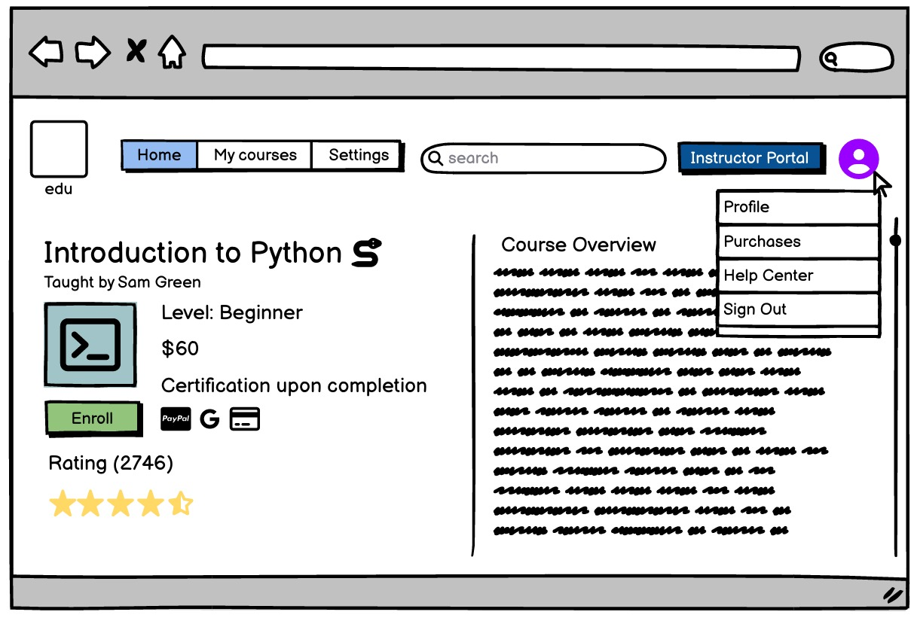

## Small-Scale E-Learning Platform Group Project
UI Mock-up
Shown below are the UI wireframes created based on the user stories and system requirements outlined in the report completed by my project partners. The goal was to translate the functional needs of students, instructors, and administrators into clear, intuitive, and accessible screen layouts. Each wireframe illustrates a key user flow, such as browsing courses, enrolling, tracking progress, managing personal profiles, accessing the instructor portal, and using the platform via mobile devices. These designs will serve as a visual blueprint for developers and testers, ensuring that user expectations are met during system development and implementation.

## Preview
[View Full Wireframes](CS335 Project Wireframes.pdf)
##

